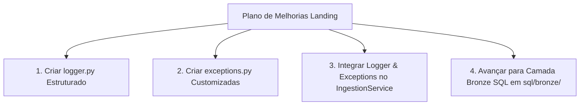

# Plano de Melhoria e Avaliação da Camada Landing

Este documento apresenta o diagnóstico detalhado do estado atual da **Camada Landing**, avaliando os componentes construídos até o momento e estabelecendo o plano de ação para melhorias de arquitetura, qualidade de código e resiliência em padrões *Enterprise Data Engineering*.

---

## 1. Diagnóstico do Estado Atual

Até este momento, a camada de ingestão e carga bruta (**Landing**) encontra-se **100% funcional e testada**:

| Componente | Status | Arquivo / Módulo | Funcionalidades Validadas |
| :--- | :--- | :--- | :--- |
| **Configuração** | 🟢 Concluído | `src/core/config.py` | Carregamento seguro via `.env` de parâmetros, chaves e rotas da API FMP. |
| **Conector FMP** | 🟢 Concluído | `src/connectors/financial_modeling_prep.py` | Extração de DRE, Balanço, Fluxo de Caixa, Profile e Quote com **retry automático e backoff** em erro `HTTP 429`. |
| **Warehouse Client** | 🟢 Concluído | `src/warehouse/bigquery_client.py` | Inicialização, criação automática de datasets, upload de DataFrames e suporte a `ALLOW_FIELD_ADDITION`. |
| **Serviço de Ingestão** | 🟢 Concluído | `src/services/ingestion_service.py` | Ingestão em lote das 24 maiores empresas por execução, pausas antirate-limit e injeção da coluna auditável **`ingested_at`** (UTC). |
| **Suite de Testes** | 🟢 Concluído | `tests/*.py` | Testes de integração cobrindo conexão, conectores, upload e ingestão multi-empresa. |
| **Documentação** | 🟢 Concluído | `docs/API.md` `docs/plano_ingestao_incremental.md` | Documentação de limites de requisições e plano arquitetural de transformações incrementais com Dataform. |

---

## 2. Oportunidades de Melhoria Identificadas

Para elevar o nível da solução de um protótipo avançado para um **Pipeline Enterprise de Produção**, foram mapeadas as seguintes oportunidades de evolução:

### 2.1. Logging Estruturado (`src/core/logger.py`)
- **Situação Atual**: Uso de comandos `print()` para saída no console.
- **Melhoria Proposta**: Implementar módulo de logging padronizado usando a biblioteca nativa `logging` do Python (ou `structlog`).
- **Benefício**: Permite que serviços de nuvem como **Google Cloud Logging** indexem logs por nível de severidade (`INFO`, `WARNING`, `ERROR`), facilitando a criação de alertas e monitoramento em tempo real.

### 2.2. Exceções Customizadas (`src/core/exceptions.py`)
- **Situação Atual**: Exceções genéricas `ValueError` ou `HTTPError`.
- **Melhoria Proposta**: Criar uma hierarquia de exceções próprias do projeto:
  - `FMPAPIError`: Erros de comunicação com a API externa.
  - `RateLimitExceededError`: Estouro de cota ou limites de requisições.
  - `BigQueryUploadError`: Falhas durante a carga de dados no BigQuery.
- **Benefício**: Isolamento de falhas e rastreabilidade precisa da causa raiz dos problemas no pipeline.

### 2.3. Validação de Schemas de Dados (Pydantic / Pandera)
- **Situação Atual**: Dados trafegam diretamente em objetos `pandas.DataFrame`.
- **Melhoria Proposta**: Adicionar camada de validação de contrato antes do upload para o BigQuery.
- **Benefício**: Garante que colunas críticas (como `symbol`, `date`, `revenue`) nunca cheguem nulas ou com tipos divergentes do contrato esperado.

### 2.4. Qualidade e Padronização de Código (Linting & Formatting)
- **Situação Atual**: Formatação manual do código Python.
- **Melhoria Proposta**: Adicionar ferramentas automatizadas de análise estática e formatação (ex: **Ruff**, **Black**, **Flake8**).
- **Benefício**: Garantia de aderência aos padrões de código PEP-8 e prevenção de erros comuns antes do commit.

---

## 3. Plano de Ação Recomendado

---

## 4. Conclusão

A Camada Landing atende 100% aos requisitos de ingestão inicial. A implementação do `logger.py` e do `exceptions.py` deixará a base de código limpa, auditável e pronta para escalar com segurança para as camadas **Bronze, Silver e Gold**.
