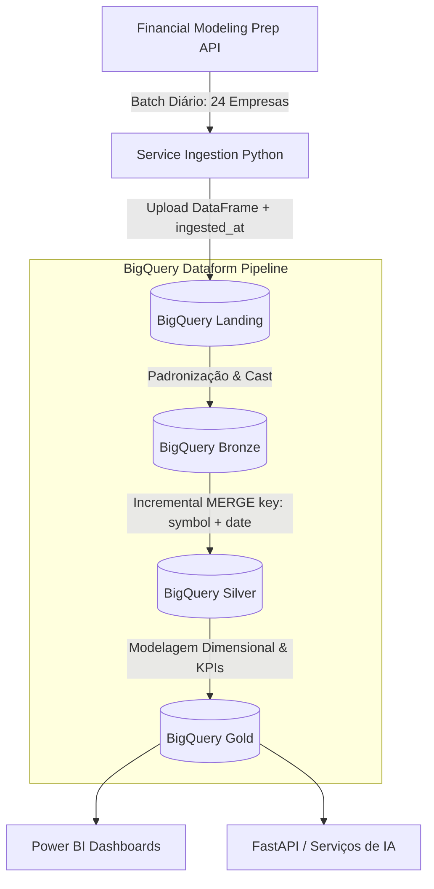

# Plano de Ingestão Incremental e Arquitetura Dataform (GCP)

Este documento detalha o planejamento arquitetural para a **ingestão incremental diária** de dados financeiros e a estruturação de transformações automatizadas no **Google BigQuery** utilizando **GCP Dataform**.

---

## 1. Contexto e Motivação

Devido à limitação de cota da API gratuita da *Financial Modeling Prep (FMP)* (~250 requisições diárias), o pipeline de dados foi desenhado para operar em **lotes diários de 24 empresas** ($24 \times 5 \text{ endpoints} = 120 \text{ chamadas/dia}$).

Para garantir que os dados acumulados a cada dia sejam integrados de forma segura, sem duplicidade e com alta qualidade, adotamos a arquitetura de **Ingestão Incremental com Dataform / SQL Medallion**.

---

## 2. Arquitetura do Pipeline Incremental

---

## 3. Detalhamento das Camadas (Medallion Architecture)

### 3.1. Camada Landing (`landing`)
- **Papel**: Armazenar os dados brutos exatamente como chegam da API FMP.
- **Formato**: Tabelas brutas por endpoint (`landing.income_statement`, `landing.quote`, `landing.balance_sheet`, etc.).
- **Metadados de Auditoria**: Inclusão automática das colunas:
  - `ingested_at`: Data e hora exata da ingestão (`TIMESTAMP`).
  - `batch_id`: Identificador do lote diário.

---

### 3.2. Camada Bronze (`bronze`)
- **Papel**: Sanitização, padronização de tipos e auditoria.
- **Transformações**:
  - Conversão de tipos de dados (`CAST(revenue AS NUMERIC)`, `CAST(date AS DATE)`).
  - Normalização de nomes de colunas para *snake_case*.
  - Remoção de registros completamente vazios ou inválidos.

---

### 3.3. Camada Silver (`silver` - Incremental MERGE)
- **Papel**: Modelagem relacional limpa, enriquecida e deduplicada.
- **Estratégia Incremental (Dataform `incremental` / `MERGE`)**:
  - Utiliza chave primária composta: `(symbol, date)` para demonstrações financeiras e `(symbol, timestamp)` para cotações.
  - **Lógica de `MERGE`**:
    - **`WHEN MATCHED`**: Se o dado da empresa para aquele ano/período já existir, **atualiza** os valores com as informações mais recentes (`UPDATE`).
    - **`WHEN NOT MATCHED`**: Se for um registro novo (vindo do lote diário de 24 empresas), **insere** a nova linha (`INSERT`).

---

### 3.4. Camada Gold (`gold` - Analítica e BI)
- **Papel**: Datamarts analíticos otimizados para relatórios e ferramentas de BI (Power BI, Tableau, APIs).
- **Entregáveis**:
  - **Dimensões**: `dim_company`, `dim_date`, `dim_indicator`.
  - **Fatos**: `fact_financial_performance`, `fact_market_quotes`.
  - **KPIs Calculados**: Margem Bruta, Margem Líquida, Margem EBITDA, ROIC, Dívida Líquida / EBITDA, P/L.

---

## 4. Cronograma de Acúmulo Incremental Diário

| Dia de Execução | Escopo de Empresas | Registros Estimados (DRE/Balanço/Fluxo) | Status da Base acumulada |
| :--- | :--- | :--- | :--- |
| **Dia 1** | Lote 1 (24 empresas) | 360 registros | 24 empresas ativas |
| **Dia 2** | Lote 2 (+24 empresas) | +360 registros | 48 empresas ativas |
| **Dia 3** | Lote 3 (+24 empresas) | +360 registros | 72 empresas ativas |
| **Dia 4** | Lote 4 (+24 empresas) | +360 registros | **96+ empresas ativas** |

---

## 5. Qualidade de Dados (Dataform Assertions)

O Dataform executará testes automatizados antes de promover os dados para a camada Silver/Gold:

1. **`uniqueKey`**: Garante que não existem empresas com datas/períodos duplicados na Silver.
2. **`nonNull`**: Garante que colunas críticas (`symbol`, `date`, `revenue`) nunca sejam nulas.
3. **`rowConditions`**: Valida se receitas e ativos possuem valores coerentes.

---

## 6. Próximos Passos para Implementação

1. [ ] Adicionar a coluna de auditoria `ingested_at` no conector/serviço de ingestão em Python.
2. [ ] Criar a estrutura das queries SQL da **Camada Bronze** (`sql/bronze/*.sql`).
3. [ ] Criar os modelos SQL da **Camada Silver** com instrução `MERGE` incremental (`sql/silver/*.sql`).
4. [ ] Criar a camada **Gold** com tabelas analíticas para Power BI (`sql/gold/*.sql`).
5. [ ] Configurar os scripts do **Dataform** para orquestração automática das dependências.
